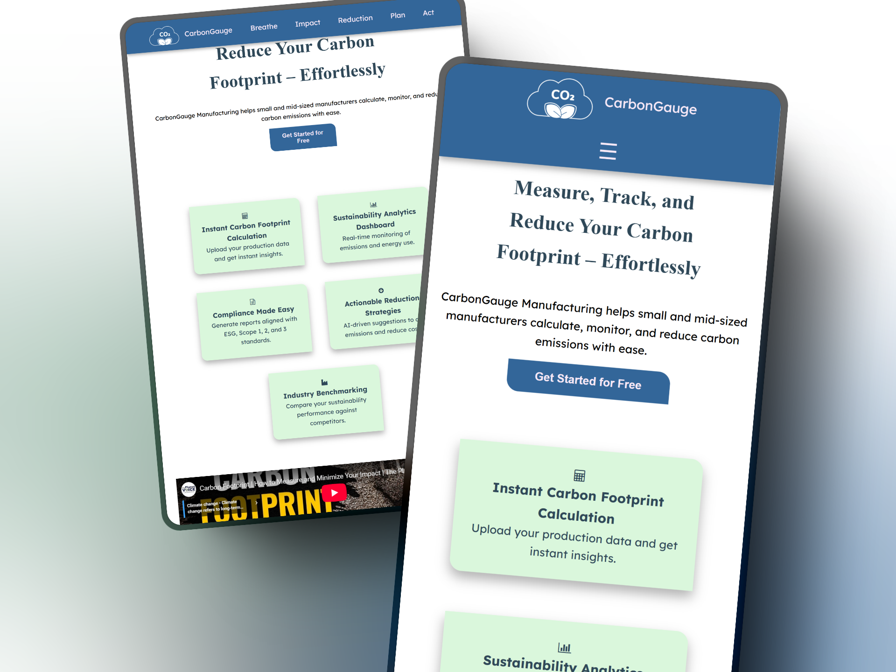

# CO2 CarbonGauge - Product Landing Page

This is a FreeCodeCamp Product Landing Page Project, built to meet the given user stories, required to submit the project.
## User Stories Implemented 

* A fixed <header> with id="header" containing a logo (id="header-img") and navigation (id="nav-bar").
* Navigation links (.nav-link) that smoothly scroll to corresponding sections.
* A hero section with a headline, subtitle, and CTA button.
* An embedded YouTube video (id="video") explaining carbon footprint reduction.
* A features section displaying product benefits using a grid layout.
* A form (id="form") with an email input (id="email") that includes a placeholder and HTML5 validation.
* A submit button (id="submit") that submits data to FreeCodeCamp’s mock URL.
* A pricing section designed with CSS Flexbox.
* A sticky navigation bar that remains at the top of the viewport.
* A responsive layout using Flexbox, Grid, and Media Queries for mobile compatibility.

## Learnings
Implementing a fixed navbar while maintaining smooth scrolling.
Making the layout responsive using flexbox and grid.
Ensuring HTML5 validation for the email input.
Styling hover effect and animation.

