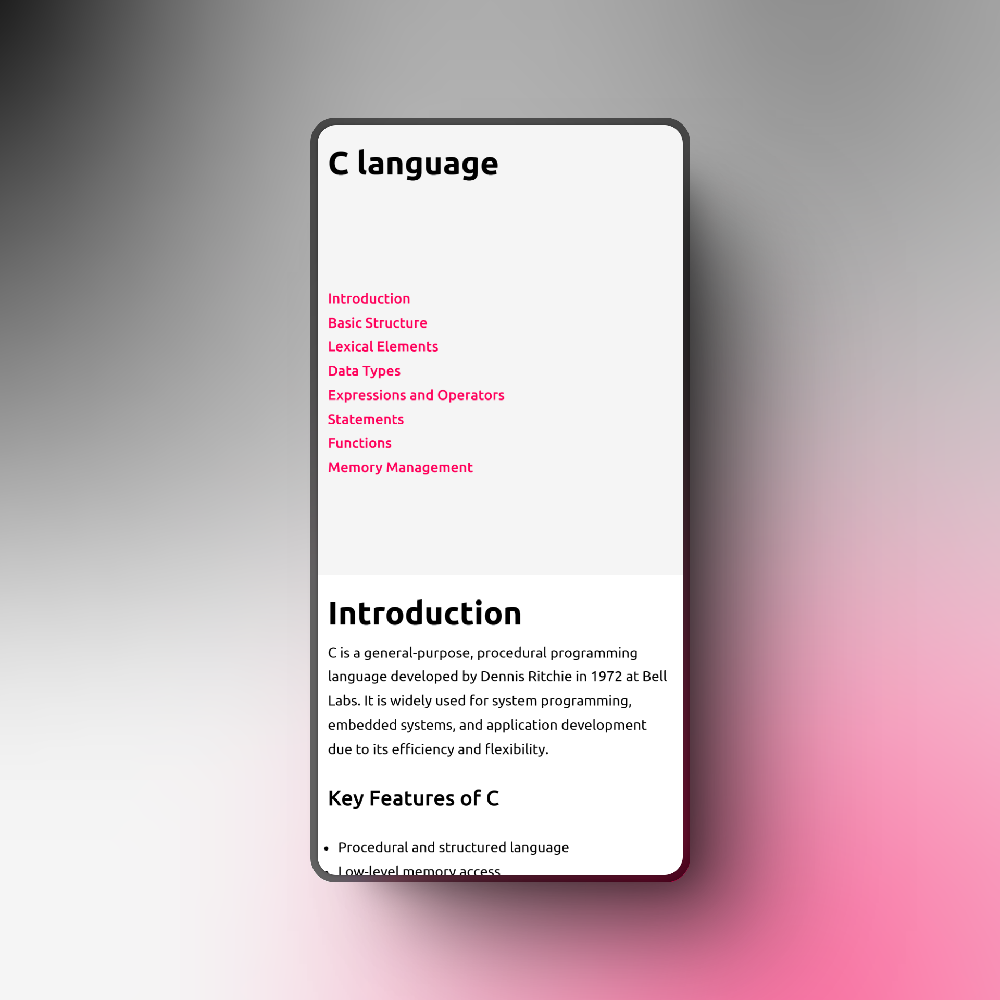
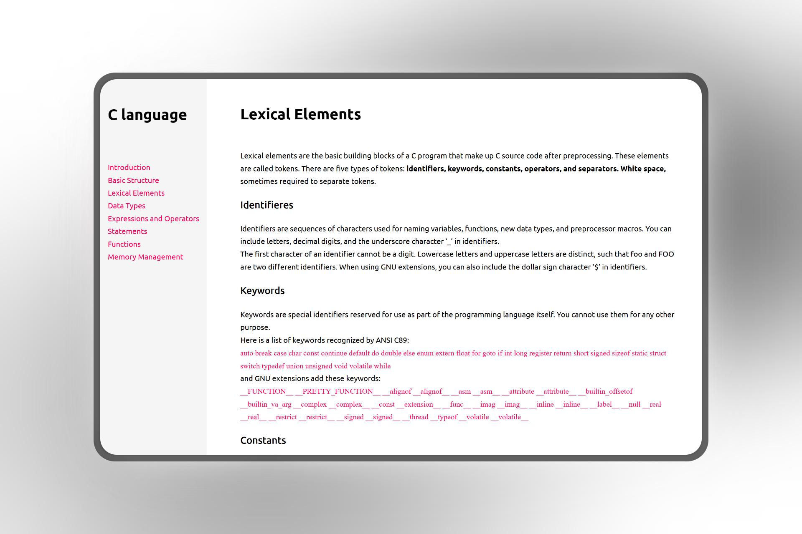

# C Language Technical Documentation

This project is a responsive technical documentation page about the C programming language. It follows the freeCodeCamp Technical Documentation Page challenge.
## User Stories Implemented 

(required to complete the project)
* The page contains a main section with an id="main-doc"
* At least five sections (<section>) with unique ids
* Each section has a header describing its content
* The navbar includes links (.nav-link) corresponding to section headers
* Clicking a navbar link navigates to the relevant section
* The navbar remains fixed on larger screens
* The page contains at least 10 paragraphs, 5 code blocks, and 5 list items
* Uses media queries for responsiveness

## Screenshot
The page has a Fixed navigation bar on the left side (on large screens),  Clickable navigation links for smooth scrolling,  Syntax-highlighted code blocks using <code> elements, Responsive design with media queries for mobile compatibility

