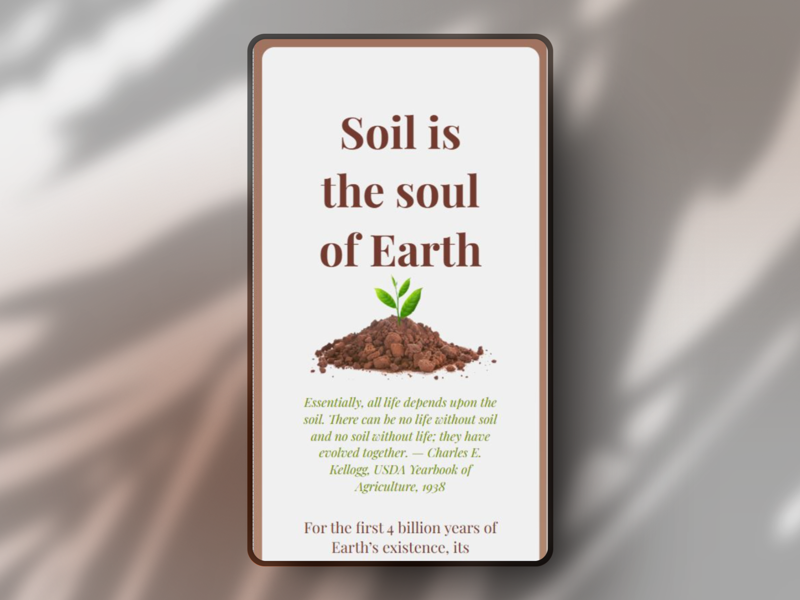

# Tribute Page - Soil

## Overview

This is a Tribute Page project built as part of the FreeCodeCamp Responsive Web Design curriculum.

## User Stories Implemented - required to complete the project

* The page contains a main element with the id="main", which includes all content.
* A title element (id="title") that describes the tribute's subject.
* A div (id="img-div") containing an image (id="image") and an image caption (id="img-caption").
* A tribute-info section with informative content about the tribute's subject.
* An anchor (id="tribute-link") linking to an external site for additional information.
* The image is responsive and centered within its parent container.
* Custom CSS animations to create a plant growth effect.
* Implemented flexbox, typography, and box model concepts from previous FreeCodeCamp lessons.

